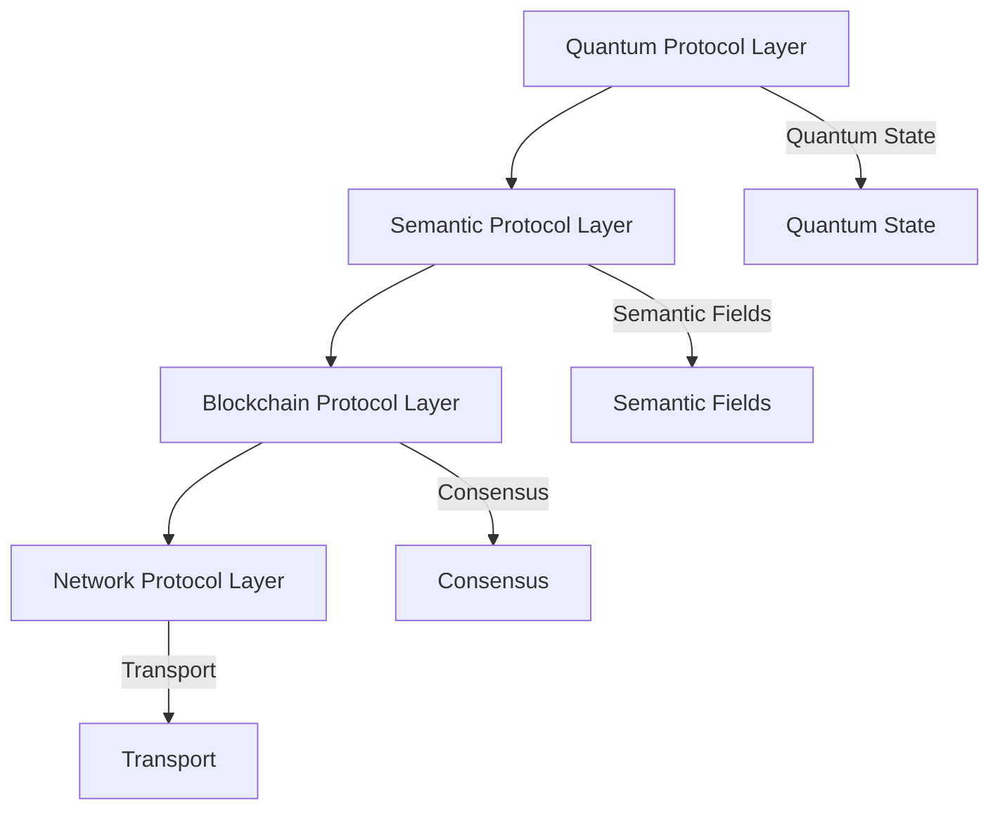

# Quantum Semantic Blockchain Network Protocols

## Core Protocol Stack

### Protocol Layers


## Quantum Protocol Layer

### Quantum State Protocol (QSP)
```yaml
quantum_state_protocol:
  version: "1.0.0"
  state_space: "infinite_dimensional"
  
  operations:
    entanglement_generation:
      type: "EPR_pairs"
      rate: "1M pairs/second"
      fidelity: 0.99
      
    state_transfer:
      method: "quantum_teleportation"
      bandwidth: "1M qubits/second"
      error_rate: 0.001
      
    measurement:
      basis: "adaptive"
      precision: "high"
      verification: "quantum_tomography"
```

### Quantum Routing Protocol (QRP)
```yaml
quantum_routing_protocol:
  version: "1.0.0"
  routing_space: "quantum_network"
  
  algorithms:
    path_finding:
      type: "quantum_dijkstra"
      metric: "entanglement_fidelity"
      optimization: "max_fidelity"
      
    route_selection:
      method: "quantum_aware"
      criteria: ["fidelity", "latency", "capacity"]
      weights: [0.5, 0.3, 0.2]
      
    load_balancing:
      strategy: "quantum_distribution"
      threshold: 0.8
      rebalance_interval: "1s"
```

### Quantum Error Correction Protocol (QECP)
```yaml
quantum_error_correction:
  version: "1.0.0"
  correction_type: "surface_code"
  
  parameters:
    code_distance: 7
    error_threshold: 0.01
    correction_cycles: "continuous"
    
  operations:
    syndrome_measurement:
      frequency: "100 kHz"
      accuracy: 0.9999
      verification: "real_time"
      
    error_correction:
      method: "adaptive"
      latency: "microseconds"
      success_rate: 0.9999
```

## Semantic Protocol Layer

### Semantic Field Protocol (SFP)
```yaml
semantic_field_protocol:
  version: "1.0.0"
  field_space: "high_dimensional"
  
  parameters:
    dimensions: 1024
    field_strength: 0.95
    coherence_time: "1s"
    
  operations:
    field_generation:
      method: "quantum_inspired"
      rate: "100K fields/second"
      stability: 0.99
      
    field_propagation:
      type: "non_local"
      speed: "instant"
      loss_rate: 0.001
```

### Semantic Routing Protocol (SRP)
```yaml
semantic_routing_protocol:
  version: "1.0.0"
  routing_space: "semantic_network"
  
  algorithms:
    path_finding:
      type: "semantic_aware"
      metric: "meaning_distance"
      optimization: "min_distance"
      
    route_selection:
      method: "context_based"
      criteria: ["relevance", "coherence", "strength"]
      weights: [0.4, 0.4, 0.2]
      
    load_balancing:
      strategy: "semantic_distribution"
      threshold: 0.85
      rebalance_interval: "1s"
```

### Semantic Validation Protocol (SVP)
```yaml
semantic_validation_protocol:
  version: "1.0.0"
  validation_type: "context_aware"
  
  parameters:
    accuracy: 0.9999
    depth: "full"
    context_size: "unlimited"
    
  operations:
    meaning_verification:
      method: "quantum_semantic"
      speed: "real_time"
      confidence: 0.9999
      
    context_validation:
      type: "multi_dimensional"
      scope: "global"
      precision: "exact"
```

## Blockchain Protocol Layer

### Consensus Protocol (CP)
```yaml
consensus_protocol:
  version: "1.0.0"
  type: "quantum_semantic_agreement"
  
  parameters:
    finality_time: "1s"
    confidence: 0.9999
    fault_tolerance: "n/3"
    
  operations:
    block_proposal:
      method: "quantum_random"
      rate: "1 block/second"
      size: "unlimited"
      
    validation:
      type: "semantic_proof"
      speed: "instant"
      verification: "quantum_assisted"
      
    finalization:
      method: "quantum_commitment"
      time: "1s"
      certainty: 0.9999
```

### Transaction Protocol (TP)
```yaml
transaction_protocol:
  version: "1.0.0"
  type: "quantum_secure"
  
  parameters:
    throughput: "100K TPS"
    latency: "milliseconds"
    size: "unlimited"
    
  operations:
    submission:
      method: "quantum_signed"
      verification: "instant"
      confirmation: "semantic"
      
    propagation:
      type: "quantum_broadcast"
      speed: "speed_of_light"
      reliability: 0.9999
      
    validation:
      method: "semantic_proof"
      time: "microseconds"
      accuracy: 0.9999
```

### State Protocol (SP)
```yaml
state_protocol:
  version: "1.0.0"
  type: "quantum_state"
  
  parameters:
    size: "unlimited"
    coherence: 0.99
    consistency: "instant"
    
  operations:
    state_update:
      method: "quantum_atomic"
      speed: "instant"
      verification: "semantic"
      
    state_sync:
      type: "quantum_assisted"
      rate: "10K blocks/second"
      validation: "real_time"
      
    state_proof:
      method: "quantum_semantic"
      size: "constant"
      verification: "instant"
```

## Network Protocol Layer

### Transport Protocol (TP)
```yaml
transport_protocol:
  version: "1.0.0"
  type: "quantum_aware"
  
  parameters:
    bandwidth: "100 Gbps"
    latency: "microseconds"
    reliability: 0.9999
    
  operations:
    packet_routing:
      method: "quantum_optimized"
      path_selection: "dynamic"
      load_balancing: "adaptive"
      
    flow_control:
      type: "quantum_aware"
      rate: "adaptive"
      congestion: "predictive"
      
    error_handling:
      method: "quantum_corrected"
      recovery: "instant"
      reliability: 0.9999
```

### Discovery Protocol (DP)
```yaml
discovery_protocol:
  version: "1.0.0"
  type: "quantum_enhanced"
  
  parameters:
    range: "global"
    speed: "instant"
    accuracy: 0.9999
    
  operations:
    node_discovery:
      method: "quantum_broadcast"
      rate: "continuous"
      verification: "semantic"
      
    peer_selection:
      type: "quantum_optimized"
      criteria: ["capacity", "reliability", "latency"]
      weights: [0.4, 0.3, 0.3]
      
    network_mapping:
      method: "quantum_topology"
      update_rate: "real_time"
      accuracy: 0.9999
```

### Security Protocol (SP)
```yaml
security_protocol:
  version: "1.0.0"
  type: "quantum_resistant"
  
  parameters:
    encryption: "post_quantum"
    authentication: "quantum_signature"
    integrity: "semantic_proof"
    
  operations:
    access_control:
      method: "quantum_authentication"
      verification: "instant"
      revocation: "immediate"
      
    threat_detection:
      type: "quantum_aware"
      monitoring: "continuous"
      response: "automatic"
      
    data_protection:
      method: "quantum_encryption"
      strength: "256-bit"
      verification: "semantic"
```

## Protocol Integration

### Cross-Layer Integration
```yaml
cross_layer_integration:
  synchronization:
    method: "quantum_coherent"
    frequency: "continuous"
    verification: "semantic"
    
  optimization:
    type: "quantum_enhanced"
    scope: "global"
    efficiency: "maximum"
    
  monitoring:
    method: "quantum_aware"
    metrics: "multi_dimensional"
    analysis: "real_time"
```

### Protocol Evolution
```yaml
protocol_evolution:
  upgrade_path:
    method: "seamless"
    compatibility: "backward"
    validation: "automatic"
    
  optimization:
    type: "continuous"
    metrics: "adaptive"
    targets: "dynamic"
    
  adaptation:
    method: "self_evolving"
    learning: "quantum_enhanced"
    improvement: "constant"
```

