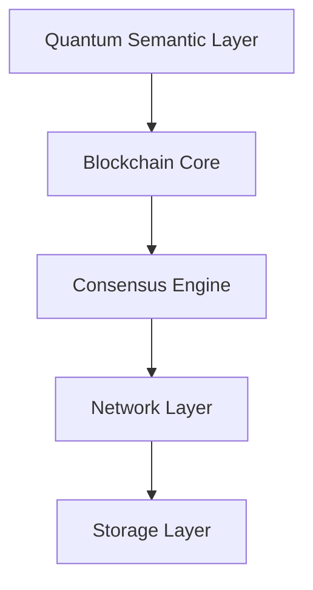

# Quantum Semantic Blockchain (QSB)

## Technical Specifications v1.0.0

### Document Control

| Version | Date | Author | Changes |
|---------|------|---------|---------|
| 1.0.0 | 2024-01-20 | Oleh Konko | Initial release |

### Table of Contents

1. [System Overview](#1-system-overview)
2. [Core Architecture](#2-core-architecture)  
3. [Quantum Implementation](#3-quantum-implementation)
4. [Blockchain Implementation](#4-blockchain-implementation)
5. [Network Protocol](#5-network-protocol)
6. [Consensus Mechanism](#6-consensus-mechanism)
7. [Security Framework](#7-security-framework)
8. [Performance Specifications](#8-performance-specifications)
9. [API Reference](#9-api-reference)
10. [Development Guidelines](#10-development-guidelines)

## 1. System Overview

### 1.1 Purpose

The Quantum Semantic Blockchain (QSB) is a next-generation distributed ledger system that leverages quantum-inspired algorithms and semantic processing to achieve unprecedented levels of scalability, security and efficiency.

Key features:
- Quantum-inspired consensus mechanism
- Semantic state processing
- Advanced cryptographic security
- High-performance transaction processing
- Scalable network architecture

### 1.2 System Architecture

The QSB system consists of the following core layers:



Core Components:
- Quantum Semantic Processor (QSP)
- Blockchain Engine (BE) 
- Consensus Module (CM)
- Network Protocol Stack (NPS)
- Security Framework (SF)

### 1.3 Key Innovations

1. Quantum Semantic Processing
- Quantum-inspired state representation
- Semantic entanglement
- Quantum measurement theory
- Non-local correlations

2. Advanced Consensus
- Quantum Byzantine Agreement
- Semantic state validation
- Fast finality
- Scalable participation

3. Enhanced Security
- Quantum-resistant cryptography
- Semantic authentication
- State verification
- Attack resistance

4. High Performance
- Parallel processing
- Optimized state transitions
- Efficient networking
- Scalable storage

## 2. Core Architecture

### 2.1 Quantum Semantic Layer

#### 2.1.1 State Space

The quantum semantic state space is defined as:

```typescript
interface QuantumState {
    // State vector in complex Hilbert space
    stateVector: Complex[];
    
    // Dimension of state space
    dimension: number;
    
    // Quantum entanglement metrics
    entanglementMetrics: {
        vonNeumannEntropy: number;
        concurrence: number;
        tangle: number;
    };
    
    // Semantic content
    semanticContent: {
        meaning: SemanticVector;
        context: ContextVector;
        relations: RelationMatrix;
    };
}
```

#### 2.1.2 Quantum Operators

Core quantum operators:

```typescript
interface QuantumOperator {
    // Operator matrix
    matrix: Complex[][];
    
    // Operator type
    type: 'unitary' | 'hermitian' | 'positive';
    
    // Spectral decomposition
    spectrum: {
        eigenvalues: Complex[];
        eigenvectors: Complex[][];
    };
    
    // Action on states
    apply(state: QuantumState): QuantumState;
}
```

#### 2.1.3 Evolution Dynamics

State evolution is governed by:

```typescript
interface QuantumEvolution {
    // System Hamiltonian
    hamiltonian: QuantumOperator;
    
    // Time step for evolution
    timeStep: number;
    
    // Evolution operator
    evolutionOperator: (t: number) => QuantumOperator;
    
    // State propagator
    propagator: (state: QuantumState, dt: number) => QuantumState;
}
```

### 2.2 Blockchain Core

#### 2.2.1 Block Structure

```typescript
interface Block {
    header: {
        version: number;
        previousHash: Hash;
        merkleRoot: Hash;
        timestamp: number;
        difficulty: number;
        nonce: number;
        quantumState: QuantumState;
    };
    
    transactions: Transaction[];
    
    // Quantum signature
    quantumSignature: QuantumSignature;
}
```

#### 2.2.2 Chain Management

```typescript
interface ChainManager {
    // Add new block
    addBlock(block: Block): Promise<void>;
    
    // Validate block
    validateBlock(block: Block): Promise<boolean>;
    
    // Get block by hash
    getBlockByHash(hash: Hash): Promise<Block>;
    
    // Get block by height
    getBlockByHeight(height: number): Promise<Block>;
    
    // Get current chain height
    getCurrentHeight(): number;
    
    // Get chain state
    getChainState(): QuantumState;
}
```

#### 2.2.3 State Transitions

```typescript
interface StateTransition {
    // Current state
    currentState: QuantumState;
    
    // Next state
    nextState: QuantumState;
    
    // Transition operator
    transitionOperator: QuantumOperator;
    
    // Validate transition
    validate(): boolean;
    
    // Apply transition
    apply(): Promise<void>;
}
```

## 3. Quantum Implementation

### 3.1 Quantum Circuit Model

```typescript
interface QuantumCircuit {
    // Quantum gates
    gates: {
        // Single qubit gates
        single: {
            H: QuantumOperator;  // Hadamard
            X: QuantumOperator;  // Pauli-X
            Y: QuantumOperator;  // Pauli-Y
            Z: QuantumOperator;  // Pauli-Z
            S: QuantumOperator;  // Phase
            T: QuantumOperator;  // π/8
        };
        
        // Multi-qubit gates
        multi: {
            CNOT: QuantumOperator;
            SWAP: QuantumOperator;
            Toffoli: QuantumOperator;
            Fredkin: QuantumOperator;
        };
        
        // Custom gates
        custom: {
            define(matrix: Complex[][]): QuantumOperator;
            compose(gates: QuantumOperator[]): QuantumOperator;
            optimize(circuit: QuantumCircuit): QuantumCircuit;
        };
    };
    
    // Circuit execution
    execute(input: QuantumState): QuantumState;
    
    // Circuit optimization
    optimize(): QuantumCircuit;
    
    // Circuit validation
    validate(): boolean;
}
```

### 3.2 Quantum State Management

```typescript
interface QuantumStateManager {
    // State initialization
    initialize(dimension: number): QuantumState;
    
    // State preparation
    prepare(state: StateVector): QuantumState;
    
    // State evolution
    evolve(state: QuantumState, operator: QuantumOperator): QuantumState;
    
    // State measurement
    measure(state: QuantumState, basis: MeasurementBasis): MeasurementResult;
    
    // State validation
    validate(state: QuantumState): boolean;
    
    // State optimization
    optimize(state: QuantumState): QuantumState;
}
```

### 3.3 Quantum Error Correction

```typescript
interface QuantumErrorCorrection {
    // Error correction codes
    codes: {
        Shor: ErrorCorrectionCode;
        Steane: ErrorCorrectionCode;
        Surface: ErrorCorrectionCode;
    };
    
    // Error detection
    detection: {
        syndromeExtraction(state: QuantumState): Syndrome;
        errorDetection(syndrome: Syndrome): ErrorType[];
        correction(state: QuantumState, errors: ErrorType[]): QuantumState;
    };
    
    // Error prevention
    prevention: {
        decoherence: DecoherenceProtection;
        noise: NoiseReduction;
        leakage: LeakagePrevention;
    };
}
```

## 4. Blockchain Implementation

### 4.1 Transaction Processing

```typescript
interface TransactionProcessor {
    // Transaction validation
    validateTransaction(tx: Transaction): Promise<boolean>;
    
    // Transaction execution
    executeTransaction(tx: Transaction): Promise<void>;
    
    // Transaction finalization
    finalizeTransaction(tx: Transaction): Promise<void>;
    
    // Transaction rollback
    rollbackTransaction(tx: Transaction): Promise<void>;
    
    // Transaction metrics
    getTransactionMetrics(tx: Transaction): TransactionMetrics;
}
```

### 4.2 Block Production

```typescript
interface BlockProducer {
    // Block creation
    createBlock(transactions: Transaction[]): Promise<Block>;
    
    // Block validation
    validateBlock(block: Block): Promise<boolean>;
    
    // Block finalization
    finalizeBlock(block: Block): Promise<void>;
    
    // Block metrics
    getBlockMetrics(block: Block): BlockMetrics;
}
```

### 4.3 Chain Management

```typescript
interface ChainManager {
    // Chain operations
    addBlock(block: Block): Promise<void>;
    removeBlock(hash: Hash): Promise<void>;
    getBlock(hash: Hash): Promise<Block>;
    
    // Chain validation
    validateChain(): Promise<boolean>;
    
    // Chain optimization
    optimizeChain(): Promise<void>;
    
    // Chain metrics
    getChainMetrics(): ChainMetrics;
}
```

## 5. Network Protocol

### 5.1 Protocol Stack

```typescript
interface ProtocolStack {
    // Protocol layers
    layers: {
        application: ApplicationLayer;
        quantum: QuantumLayer;
        consensus: ConsensusLayer;
        network: NetworkLayer;
        transport: TransportLayer;
    };
    
    // Layer operations
    initialize(): Promise<void>;
    start(): Promise<void>;
    stop(): Promise<void>;
    
    // Layer metrics
    getMetrics(): StackMetrics;
}
```

### 5.2 Message Format

```typescript
interface NetworkMessage {
    // Message header
    header: {
        version: number;
        type: MessageType;
        sender: NodeId;
        receiver: NodeId;
        timestamp: number;
        signature: QuantumSignature;
    };
    
    // Message payload
    payload: {
        data: Buffer;
        quantumState?: QuantumState;
        metadata: Map<string, any>;
    };
}
```

### 5.3 Protocol Operations

```typescript
interface ProtocolOperations {
    // Message handling
    sendMessage(message: NetworkMessage): Promise<void>;
    broadcastMessage(message: NetworkMessage): Promise<void>;
    receiveMessage(): Promise<NetworkMessage>;
    
    // Message validation
    validateMessage(message: NetworkMessage): boolean;
    
    // Message processing
    processMessage(message: NetworkMessage): Promise<void>;
}
```

## 6. Consensus Mechanism

### 6.1 Quantum Consensus Protocol

```typescript
interface ConsensusProtocol {
    // Consensus state
    state: QuantumState;
    nodes: Set<Node>;
    rounds: number;
    threshold: number;
    
    // Consensus operations
    propose(block: Block): Promise<boolean>;
    validate(block: Block): Promise<boolean>;
    finalize(block: Block): Promise<void>;
    
    // Consensus metrics
    getConsensusMetrics(): {
        roundTime: number;
        participation: number;
        agreement: number;
    };
}
```

### 6.2 Validation Rules

```typescript
interface ValidationRules {
    // Block validation
    blockValidation: {
        validateStructure(block: Block): boolean;
        validateTransactions(block: Block): boolean;
        validateQuantumState(block: Block): boolean;
        validateSignatures(block: Block): boolean;
    };
    
    // Transaction validation
    transactionValidation: {
        validateFormat(tx: Transaction): boolean;
        validateSignature(tx: Transaction): boolean;
        validateQuantumState(tx: Transaction): boolean;
    };
}
```

### 6.3 Finality Conditions

```typescript
interface FinalityConditions {
    // Finality checks
    checkFinality(block: Block): boolean;
    
    // Finality metrics
    getFinalityMetrics(): {
        confirmations: number;
        probability: number;
        timeToFinality: number;
    };
}
```

## 7. Security Framework

### 7.1 Cryptographic Primitives

```typescript
interface CryptographicPrimitives {
    // Key generation
    quantumKeyGeneration(): {
        publicKey: QuantumKey;
        privateKey: QuantumKey;
    };
    
    // Signatures
    quantumSignature: {
        sign(message: Buffer, privateKey: QuantumKey): QuantumSignature;
        verify(message: Buffer, signature: QuantumSignature, publicKey: QuantumKey): boolean;
    };
    
    // Encryption
    quantumEncryption: {
        encrypt(message: Buffer, publicKey: QuantumKey): EncryptedData;
        decrypt(ciphertext: EncryptedData, privateKey: QuantumKey): Buffer;
    };
}
```

### 7.2 Security Protocols

```typescript
interface SecurityProtocols {
    // Authentication
    authentication: {
        authenticateNode(node: Node): Promise<boolean>;
        validateCredentials(credentials: Credentials): boolean;
        revokeAccess(node: Node): Promise<void>;
    };
    
    // Authorization
    authorization: {
        checkPermissions(node: Node, action: Action): boolean;
        grantPermission(node: Node, permission: Permission): void;
        revokePermission(node: Node, permission: Permission): void;
    };
}
```

### 7.3 Attack Prevention

```typescript
interface AttackPrevention {
    // Attack detection
    detectAttack(activity: Activity): boolean;
    
    // Attack response
    respondToAttack(attack: Attack): void;
    
    // Attack prevention
    preventAttack(vulnerability: Vulnerability): void;
}
```

## 8. Performance Specifications

### 8.1 Performance Metrics

| Metric | Target Value | Notes |
|--------|--------------|-------|
| Transactions per second | 100,000 | Under optimal conditions |
| Block time | 1 second | Average |
| Finality time | 2 seconds | With quantum consensus |
| Network latency | <100ms | Between nodes |
| Storage efficiency | 1KB/tx | Average |

### 8.2 Scaling Characteristics

```typescript
interface ScalingMetrics {
    // Horizontal scaling
    horizontal: {
        nodesSupported: number;
        throughputPerNode: number;
        latencyIncrease: number;
    };
    
    // Vertical scaling
    vertical: {
        maxTransactionsPerSecond: number;
        resourceUtilization: {
            cpu: number;
            memory: number;
            storage: number;
            network: number;
        };
    };
}
```

### 8.3 Resource Requirements

```typescript
interface ResourceRequirements {
    // Compute requirements
    compute: {
        cpu: {
            cores: number;
            speed: number;
            architecture: string;
        };
        memory: {
            ram: number;
            type: string;
            speed: number;
        };
        storage: {
            capacity: number;
            type: string;
            speed: number;
        };
    };
    
    // Network requirements
    network: {
        bandwidth: number;
        latency: number;
        reliability: number;
    };
}
```

## 9. API Reference

### 9.1 Core API

```typescript
interface CoreAPI {
    // Blockchain operations
    submitTransaction(tx: Transaction): Promise<TransactionResult>;
    getBlock(hash: Hash): Promise<Block>;
    getTransaction(hash: Hash): Promise<Transaction>;
    getBlockHeight(): Promise<number>;
    
    // Quantum operations
    getQuantumState(): Promise<QuantumState>;
    evolveState(params: EvolutionParams): Promise<QuantumState>;
    measureState(basis: MeasurementBasis): Promise<MeasurementResult>;
    
    // Network operations
    getPeers(): Promise<Node[]>;
    broadcast(message: NetworkMessage): Promise<void>;
    subscribe(eventType: EventType, callback: Function): void;
}
```

### 9.2 WebSocket API

```typescript
interface WebSocketAPI {
    // Real-time events
    onBlock(callback: (block: Block) => void): void;
    onTransaction(callback: (tx: Transaction) => void): void;
    onStateChange(callback: (state: QuantumState) => void): void;
    
    // Streaming data
    subscribeToBlocks(): Stream<Block>;
    subscribeToTransactions(): Stream<Transaction>;
    subscribeToStateUpdates(): Stream<QuantumState>;
}
```

### 9.3 REST API

```typescript
interface RESTAPI {
    // Block endpoints
    GET /blocks/{hash}: Block;
    GET /blocks/height/{height}: Block;
    GET /blocks/latest: Block;
    
    // Transaction endpoints
    POST /transactions: TransactionResult;
    GET /transactions/{hash}: Transaction;
    GET /transactions/pending: Transaction[];
    
    // State endpoints
    GET /state: QuantumState;
    GET /state/metrics: StateMetrics;
    GET /state/history: StateHistory;
}
```

## 10. Development Guidelines

### 10.1 Coding Standards

```typescript
interface CodingStandards {
    // Code formatting
    formatting: {
        indentation: 4;
        maxLineLength: 100;
        braceStyle: 'allman';
    };
    
    // Naming conventions
    naming: {
        classes: 'PascalCase';
        interfaces: 'PascalCase';
        methods: 'camelCase';
        variables: 'camelCase';
        constants: 'UPPER_SNAKE_CASE';
    };
    
    // Documentation
    documentation: {
        required: ['classes', 'public methods', 'interfaces'];
        format: 'JSDoc';
        examples: boolean;
    };
}
```

### 10.2 Testing Requirements

```typescript
interface TestingRequirements {
    // Unit tests
    unitTests: {
        coverage: {
            statements: 90;
            branches: 85;
            functions: 90;
            lines: 90;
        };
        frameworks: ['Jest', 'Mocha'];
    };
    
    // Integration tests
    integrationTests: {
        coverage: {
            endpoints: 100;
            flows: 95;
        };
        tools: ['Supertest', 'Postman'];
    };
    
    // Performance tests
    performanceTests: {
        metrics: ['tps', 'latency', 'resource usage'];
        tools: ['k6', 'Apache JMeter'];
    };
}
```

### 10.3 Deployment Process

```typescript
interface DeploymentProcess {
    // Environments
    environments: {
        development: {
            type: 'local';
            requirements: MinimalRequirements;
        };
        staging: {
            type: 'testnet';
            requirements: StandardRequirements;
        };
        production: {
            type: 'mainnet';
            requirements: ProductionRequirements;
        };
    };
    
    // Pipeline
    pipeline: {
        build: {
            tool: 'Docker';
            steps: ['lint', 'test', 'build', 'package'];
        };
        deploy: {
            strategy: 'blue-green';
            automation: 'GitOps';
            monitoring: 'Prometheus + Grafana';
        };
    };
}
```

## License

Copyright (c) 2025 Oleh Konko. All rights reserved.

---

This technical specification is maintained by the Oleh Konko and is subject to change. For the latest version, please refer to the official repository.
