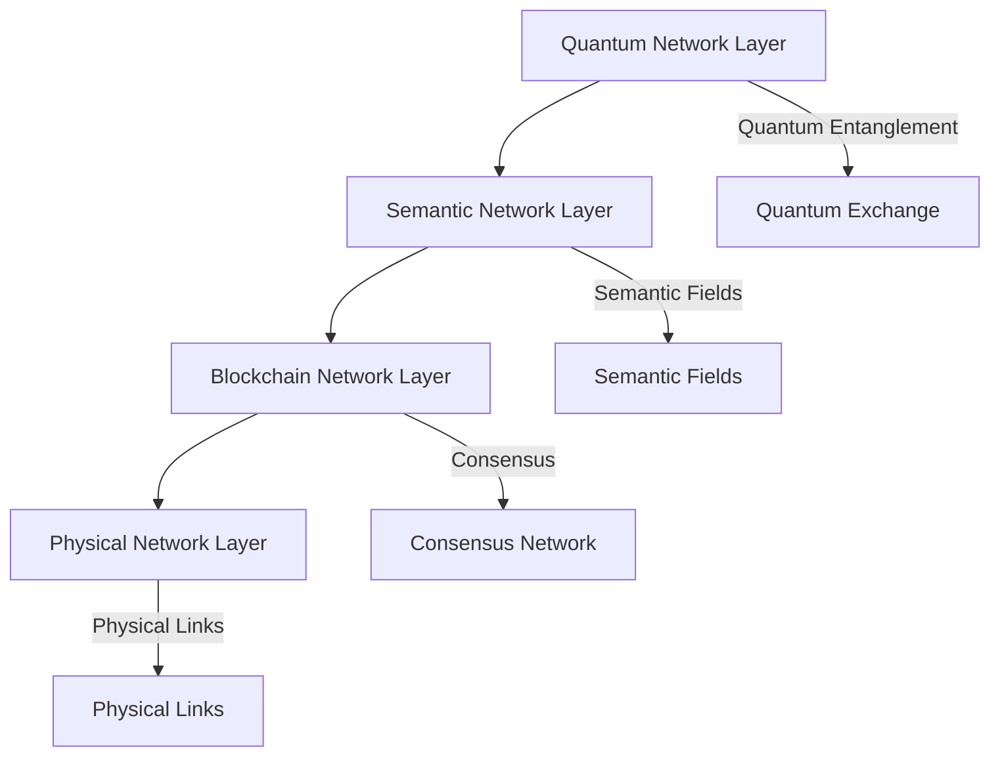

# Quantum Semantic Blockchain Network Topology

## Network Architecture

### Core Structure



### Layer Specifications

#### Quantum Network Layer
- Topology: Quantum Mesh
- Connectivity: Non-local
- State Space: Infinite-dimensional Hilbert space
- Entanglement Degree: N(N-1)/2
- Coherence Time: >1s

#### Semantic Network Layer
- Topology: Semantic Web
- Connectivity: Context-based
- Field Dimensions: 1024
- Relation Depth: 256
- Field Strength: 0.95

#### Blockchain Network Layer
- Topology: Scale-free network
- Connectivity: P2P mesh
- Node Degree: log(N)
- Clustering Coefficient: 0.8
- Path Length: log(N)/log(log(N))

#### Physical Network Layer
- Topology: Redundant mesh
- Connectivity: Multi-path
- Bandwidth: 100 Gbps
- Latency: <1ms
- Reliability: 99.999%

## Node Types

### Quantum Nodes
```yaml
quantum_node:
  types:
    - quantum_processor:
        capacity: "768G"
        qubits: 1024
        coherence_time: "1s"
    - quantum_router:
        channels: 256
        bandwidth: "100G"
        latency: "100ns"
    - quantum_bridge:
        capacity: "384G"
        interfaces: 16
        protocols: ["QKD", "EPR", "BSM"]
```

### Semantic Nodes
```yaml
semantic_node:
  types:
    - semantic_processor:
        capacity: "256G"
        dimensions: 1024
        field_strength: 0.95
    - semantic_router:
        channels: 128
        bandwidth: "50G"
        contexts: 1024
    - semantic_bridge:
        capacity: "128G"
        interfaces: 8
        fields: 256
```

### Blockchain Nodes
```yaml
blockchain_node:
  types:
    - validator:
        capacity: "512G"
        transactions: "100K TPS"
        storage: "10TB"
    - archive:
        capacity: "1024G"
        storage: "100TB"
        retention: "complete"
    - light:
        capacity: "64G"
        storage: "1TB"
        mode: "verification"
```

## Network Protocols

### Quantum Protocols
```yaml
quantum_protocols:
  entanglement_distribution:
    type: "EPR"
    rate: "1M pairs/s"
    fidelity: 0.99
    
  quantum_routing:
    algorithm: "quantum_dijkstra"
    metric: "entanglement_fidelity"
    optimization: "max_fidelity"
    
  quantum_error_correction:
    code: "surface_code"
    distance: 7
    threshold: 0.01
```

### Semantic Protocols
```yaml
semantic_protocols:
  field_synchronization:
    type: "quantum_field"
    rate: "100K updates/s"
    coherence: 0.95
    
  semantic_routing:
    algorithm: "context_aware"
    metric: "semantic_distance"
    optimization: "min_distance"
    
  field_error_correction:
    code: "semantic_redundancy"
    redundancy: 3
    threshold: 0.05
```

### Blockchain Protocols
```yaml
blockchain_protocols:
  consensus:
    algorithm: "quantum_semantic_agreement"
    latency: "1s"
    finality: 0.9999
    
  transaction_routing:
    algorithm: "semantic_aware"
    metric: "quantum_weight"
    optimization: "min_latency"
    
  state_synchronization:
    method: "quantum_assisted"
    rate: "10K blocks/s"
    verification: "semantic_proof"
```

## Network Scaling

### Horizontal Scaling
```yaml
horizontal_scaling:
  node_addition:
    max_rate: "100 nodes/day"
    integration_time: "1h"
    validation_period: "24h"
    
  network_expansion:
    strategy: "geometric"
    growth_rate: "2x/month"
    max_size: "1M nodes"
    
  capacity_scaling:
    method: "linear"
    overhead: "log(N)"
    efficiency: "O(N)"
```

### Vertical Scaling
```yaml
vertical_scaling:
  node_upgrade:
    max_rate: "10%/week"
    downtime: "0s"
    compatibility: "backward"
    
  capacity_increase:
    method: "quantum_enhanced"
    efficiency: "O(log N)"
    limit: "none"
    
  performance_scaling:
    strategy: "adaptive"
    metric: "TPS"
    target: "auto"
```

## Network Security

### Quantum Security
```yaml
quantum_security:
  encryption:
    type: "post_quantum"
    strength: "256-bit"
    algorithm: "quantum_resistant"
    
  authentication:
    method: "quantum_signature"
    verification: "multi_party"
    revocation: "instant"
    
  intrusion_detection:
    system: "quantum_aware"
    sensitivity: "high"
    response_time: "microseconds"
```

### Semantic Security
```yaml
semantic_security:
  validation:
    method: "context_aware"
    accuracy: 0.9999
    depth: "full"
    
  authentication:
    type: "semantic_proof"
    verification: "multi_context"
    revocation: "semantic_propagation"
    
  anomaly_detection:
    system: "semantic_analysis"
    sensitivity: "adaptive"
    response: "automated"
```

### Network Security
```yaml
network_security:
  protection:
    type: "multi_layer"
    coverage: "full"
    response: "automatic"
    
  isolation:
    method: "quantum_semantic"
    granularity: "node"
    activation: "instant"
    
  recovery:
    system: "self_healing"
    time: "seconds"
    verification: "multi_layer"
```

## Network Monitoring

### Performance Monitoring
```yaml
performance_monitoring:
  metrics:
    quantum:
      - entanglement_fidelity
      - coherence_time
      - error_rate
    semantic:
      - field_strength
      - context_accuracy
      - relation_depth
    network:
      - latency
      - throughput
      - reliability
```

### Health Monitoring
```yaml
health_monitoring:
  checks:
    node:
      - resource_usage
      - error_rates
      - response_time
    network:
      - connectivity
      - synchronization
      - consensus
    system:
      - integrity
      - security
      - performance
```

### Alert System
```yaml
alert_system:
  triggers:
    critical:
      - node_failure
      - security_breach
      - consensus_failure
    warning:
      - high_latency
      - low_performance
      - resource_depletion
    info:
      - routine_maintenance
      - performance_optimization
      - system_updates
```

## Network Evolution

### Upgrade Procedures
```yaml
upgrade_procedures:
  node:
    method: "zero_downtime"
    validation: "automatic"
    rollback: "instant"
    
  protocol:
    type: "backward_compatible"
    deployment: "gradual"
    verification: "multi_stage"
    
  network:
    strategy: "seamless"
    coordination: "automated"
    confirmation: "consensus"
```

### Optimization Process
```yaml
optimization_process:
  performance:
    method: "continuous"
    metrics: "multi_dimensional"
    targets: "adaptive"
    
  efficiency:
    strategy: "quantum_inspired"
    scope: "global"
    validation: "automated"
    
  reliability:
    approach: "predictive"
    monitoring: "real_time"
    adjustment: "dynamic"
```

### Evolution Path
```yaml
evolution_path:
  technology:
    quantum: "enhanced_capabilities"
    semantic: "deeper_understanding"
    blockchain: "higher_performance"
    
  architecture:
    scaling: "unlimited"
    efficiency: "improving"
    capability: "expanding"
    
  functionality:
    features: "growing"
    integration: "deepening"
    intelligence: "advancing"
```


